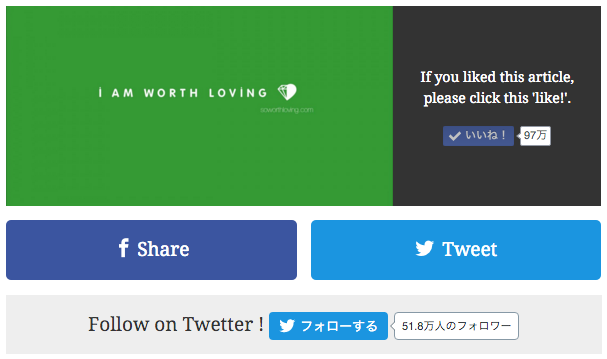
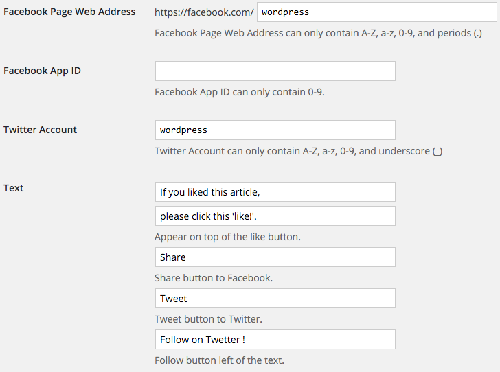
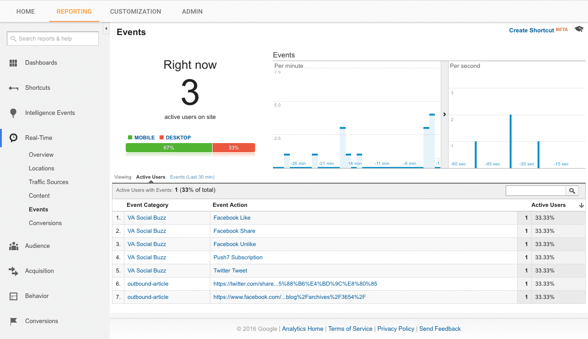
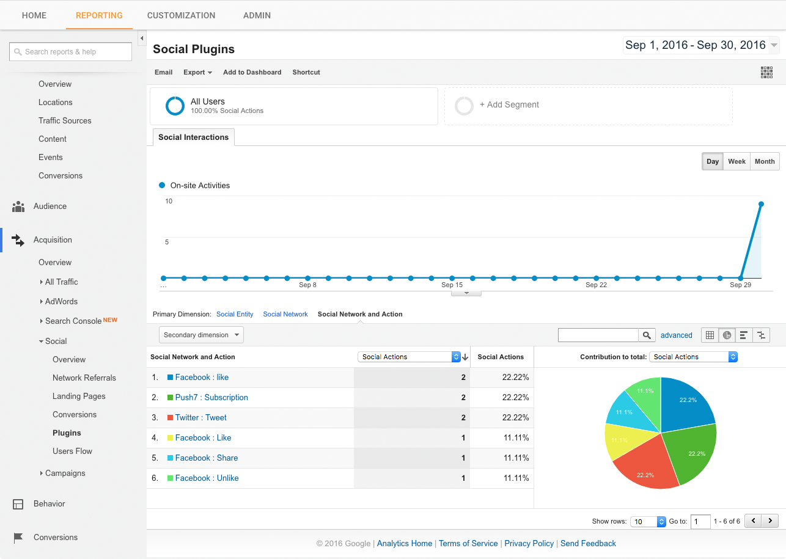

VA Social Buzz
==============================

It displays buttons at the end of every article for readers to "Like" your recommended Facebook page, to share the article on social, and to follow you on social.

## Description

It displays buttons at the end of every article for readers to "Like" your recommended Facebook page, to share the article on Facebook, to tweet about it on Twitter, and to follow you on Twitter. japanese viral media often uses this kind of display.

If Google Universal Analytics is introduced to the website, it will become possible to track how many clicks etc each particular event gets.

## Requires
* WordPress 4.5 or higher
* PHP 5.6+  
PHP 7 is not tested.

## Installation

To install VA Social Buzz:

1. Upload the "va-social-buzz" directory and all its contents to your `/wp-content/plugins/` directory.
2. Activate the plugin through the 'Plugins' menu in WordPress.
3. Optimize your setting through the `Option`>`Reading` menu in WordPress.

## Screenshots

  
**1. View.**

  
**2. Admin.**

  
**3. Google Analytics - Event.**

  
**4. Google Analytics - Social Plugin.**

## Changelog

### 1.0.16
* Bug fix.

### 1.0.15
* Security update.

### 1.0.14
* Add new action & filter.
* Clean up.

### 1.0.13
* Bug fix.

### 1.0.12
* Clean up.

### 1.0.11
* Bug fix.

### 1.0.10
* Fixed a bug that occurred when opening in the browser of a third party smartphone application.

### 1.0.9
* Bug fix.

### 1.0.8
* Bug fix.

### 1.0.7
* Remove the style attributes from HTML elements.

### 1.0.6
* CSS fixes.

### 1.0.5
* Was to be able to change the color of the the like button area.

### 1.0.4
* Update readme.

### 1.0.3
* Choose the post type to display.
* Google Analytics Events Tracking.
* Add i18n.

### 1.0.2
* Add image size.

### 1.0.1
* Update the readme.txt.

### 1.0.0
* First public release to WordPress.org.

### 0.0.1 (Beta)
* First public release.

### 0.0.1 (Alpha)
* First private release.
